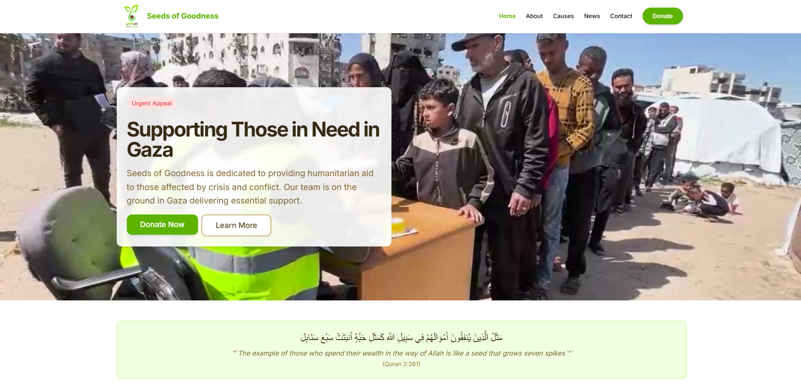
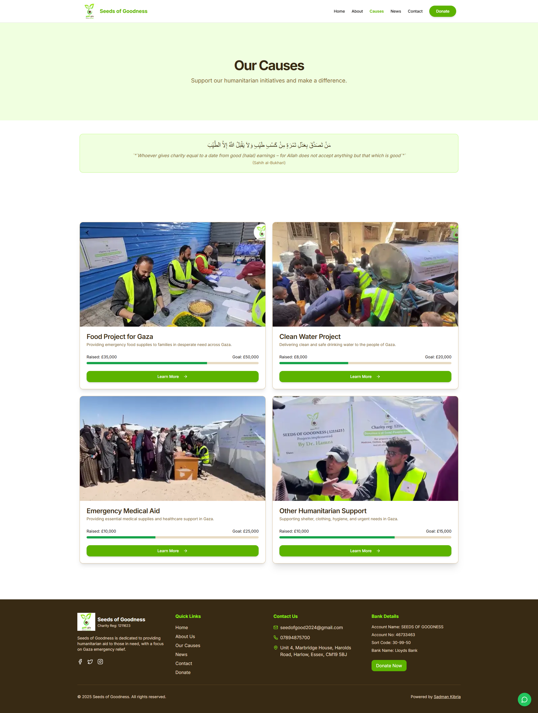
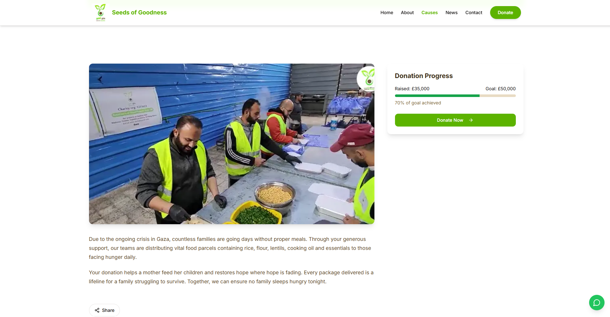
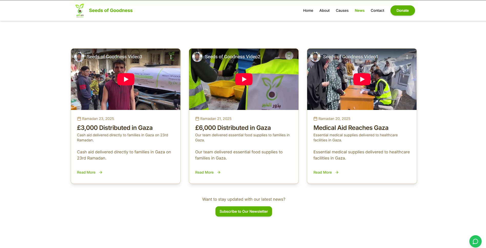

### Seeds of Goodness Charity Website

## Table of Contents

- [Introduction](#introduction)
- [Screenshots](#screenshots)
- [Features](#features)
- [Tech Stack](#tech-stack)
- [Getting Started](#getting-started)
- [Usage](#usage)
- [Project Structure](#project-structure)
- [Challenges and Solutions](#challenges-and-solutions)
- [Key Learning](#key-learning)
- [Future Enhancements](#future-enhancements)
- [Contact](#contact)

## Introduction

Seeds of Goodness is a modern, humanitarian focused charity website built to promote urgent causes, humanitarian projects and raise support for the people of Gaza and other communities in need.
This project demonstrates my ability to build clean, accessible and professional websites tailored for real-world charitable organisations.

The platform is designed to display active causes, news updates and guide users towards donating via bank transfer and in-person contributions, while providing internal tools for future administrative growth.

## Screenshots

1.  **Homepage Hero Section**
    
2.  **Causes Page**
    
    **Causes Details**
    
3.  **News Page**
    

## Features

- **Responsive Design:** Fully responsive layout that works seamlessly across all devices
- **Causes Management (Static)** Showcase multiple causes with progress bars
- **News Updates (Static):** Share recent activities and project highlights with embedded videos
- **WhatsApp Chat Integration:** Direct WhatsApp messaging button for instant communication
- **SEO Optimisation** Dynamic metadata, Open Graph tags and JSON-LD structured data
- **Admin-Ready Frontend:** Built reusable admin templates (news/article creation pages) structured for seamless future integration with any CMS or custom API
- **Offline Donation Handling:** Donation instructions provided for bank transfer and in-person giving
- **Performance Focused:** Fast page loads, optimised assets and clean, maintainable code
- **Contact Integration:** Email contact functionality as per client requirement

## Tech Stack

This project leverages the following modern technologies:

- **Next.js 14:** App Router, Server Components
- **TypeScript:** Type safety throughout the app
- **Tailwind CSS:** Responsive, utility-first styling
- **Shadcn UI:** Customisable UI components
- **Lucide React:** Lightweight icon library
- **SEO Optimisation:** Custom metadata, JSON-LD structured data
- **Responsive Images:** Next.js Image component for optimised image loading

## Getting Started

1. Clone this repository to your local machine:

```shellscript
git clone https://github.com/SadmanKibria/Seed-of-Goodness.git
```

2. Navigate to the project directory:

```shellscript
cd seedsofgoodness
```

3. Install dependencies:

```shellscript
npm install
```

4. Run the development server:

```shellscript
npm run dev
```

5. Open [http://localhost:3000](http://localhost:3000) in your browser to see the application.

## Usage

The website is structured to provide a seamless user experience:

1. **Homepage:** Overview of the charity mission, featured causes and recent news
2. **Causes Section:** Displays urgent humanitarian causes with donation progress tracking
3. **News Section:** Lists latest distribution updates with video confirmations
4. **Cause Detail Pages:** In-depth description and donation progress
5. **Manual Donations:** Visitors are guided to donate via bank transfer
6. **Contact:** Direct email contact functionality

## Project Structure

The project follows a clean, modular architecture:

```plaintext
/
├── app/                  # Pages and routes (Next.js App Router)
│   ├── causes/           # Causes pages
│   ├── news/             # News pages
│   ├── donate/           # Donation guidance
│   └── layout.tsx        # Global layout and metadata
├── components/           # Reusable components (navbar, footer, quote card, UI buttons)
├── lib/                  # Utility functions (SEO config, data models)
├── public/               # Static assets
└── styles/               # Tailwind and global styles

```

## Challenges and Solutions

1. **Handling Donations Without Online Payments**

1. **Challenge:** The charity accepts only offline donations (bank transfer, cash).
1. **Solution:** Designed a clear manual donation flow that still builds user trust and transparency without a payment gateway.

1. **Responsive Navigation:**

1. **Challenge:** Creating an intuitive navigation system that works across all devices
1. **Solution:** Developed a responsive navbar with dropdown menus for desktop and a slide-out menu for mobile

1. **Performance Optimisation:**

1. **Challenge:** Ensuring fast load times with image-heavy content
1. **Solution:** Utilized Next.js Image component, code splitting and lazy loading techniques

## Key Learning

- Designing scalable architecture even for static projects
- Applying real-world SEO strategies in humanitarian sectors
- Structuring apps with future backend upgrades in mind
- Balancing user-friendliness and professionalism in charity projects
- Handling offline-only donation flows smoothly

## Future Enhancements

- **Authentication System:** Add user authentication for client portals
- **Dynamic Admin Panel:** Build a full CMS system for managing causes, news, and campaigns
- **Multi-language Support:** Expand reach to non-English speaking donors
- **Analytics Dashboard:** Track visitor interactions and donation interests
- **Donation Gateway:** Integrate Stripe or PayPal for online donations (with Islamic compliance checks)
- **Newsletter Integration:** Collect emails and send automatic updates
- **Newsletter Integration:** Collect emails and send automatic updates

## Contact

For any inquiries about this project or to discuss potential opportunities, please contact me at:

- **Email:** [sadmankibria1@gmail.com](mailto:your.email@example.com)
- **Portfolio:** [sadmankibria.com](https://sadmankibria.com/)

---

This client project demonstrates my ability to deliver high-quality, performant web applications that meet specific business requirements. I pride myself on creating solutions with attention to detail, clean code architecture and modern development practices while ensuring exceptional user experiences.
